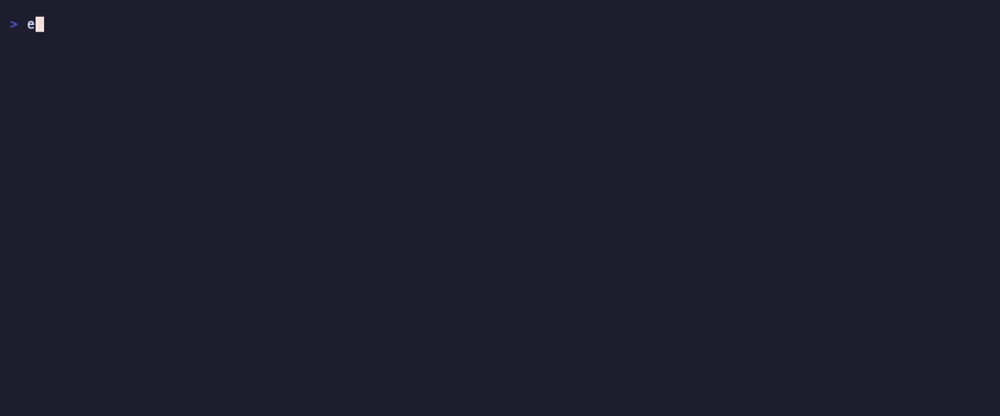
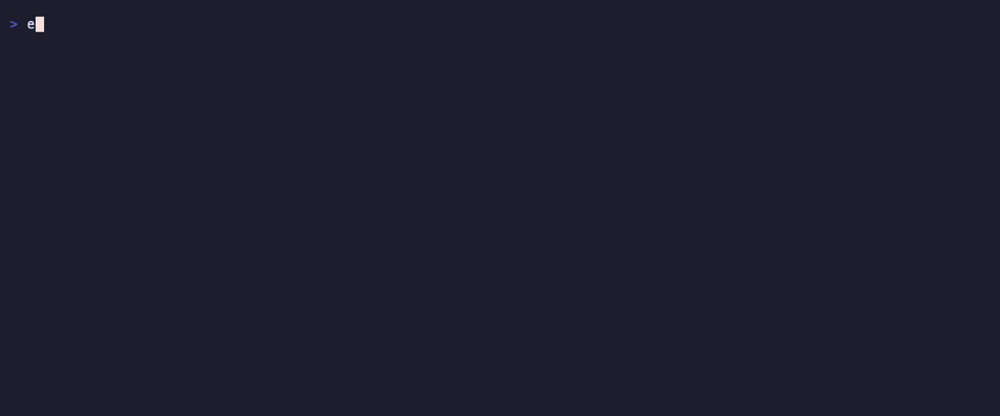

# Edge Delta Agent Skills

Edge Delta skills for AI agents (Claude Code, Cursor, Copilot and other
SKILL.md-compatible tools), built on the [`edx` CLI](https://github.com/edgedelta/edx).

## See it in action

Schema discovery before querying (the **ed-logs** flow — find field values,
then search):



Incident triage (the **ed-investigate** flow — recent alert events, then
surging negative log patterns):



Clips are generated with [vhs](https://github.com/charmbracelet/vhs) from the
tape scripts in [`demo/`](demo/) — re-record with `vhs demo/<name>.tape`
(requires an authenticated `edx`; no credentials appear on screen).

## Skills

| Skill | Description |
|-------|-------------|
| [ed-edx](ed-edx/SKILL.md) | Primary CLI - all edx commands, auth, setup |
| [ed-logs](ed-logs/SKILL.md) | Search logs with CQL, log volume graphs |
| [ed-patterns](ed-patterns/SKILL.md) | Log patterns, anomaly and sentiment analysis |
| [ed-metrics](ed-metrics/SKILL.md) | Discover and aggregate metrics |
| [ed-traces](ed-traces/SKILL.md) | Distributed traces and the service map |
| [ed-events](ed-events/SKILL.md) | Events: anomalies, monitor alerts, K8s events |
| [ed-monitors](ed-monitors/SKILL.md) | Create, manage and resolve monitors |
| [ed-pipelines](ed-pipelines/SKILL.md) | Fleet management, config changes, deployments, live capture |
| [ed-investigate](ed-investigate/SKILL.md) | Cross-signal incident investigation workflow |
| [ed-ai-teammate](ed-ai-teammate/SKILL.md) | AI Teammate connectors and activity |

## Setup edx

```bash
go install github.com/edgedelta/edx@latest
edx auth login --token <api-token> --org-id <org-id>
edx auth status
```

API tokens are created in the Edge Delta web app under **Admin → API Tokens**.
Environment variables `ED_API_TOKEN`, `ED_ORG_ID` and `ED_API_URL` override
the config file - useful in CI.

## Install Skills

```bash
npx skills add edgedelta/agent-skills \
  --skill ed-edx \
  --skill ed-logs \
  --skill ed-patterns \
  --skill ed-metrics \
  --skill ed-traces \
  --skill ed-monitors \
  --skill ed-pipelines \
  --full-depth -y
```

Or copy the skill directories you need into your agent's skills folder
(e.g. `.claude/skills/`).

## Conventions Used Across Skills

- Discovery before queries: `edx facets keys` / `edx facets options` to find
  field names and values before writing CQL.
- Time ranges: `--lookback 1h` (Go durations) or `--from/--to` (ISO 8601).
- Default output is JSON; `--output table --columns ...` for summaries.
- Destructive operations (`deploy`, `delete`) require `--yes` when
  non-interactive.
